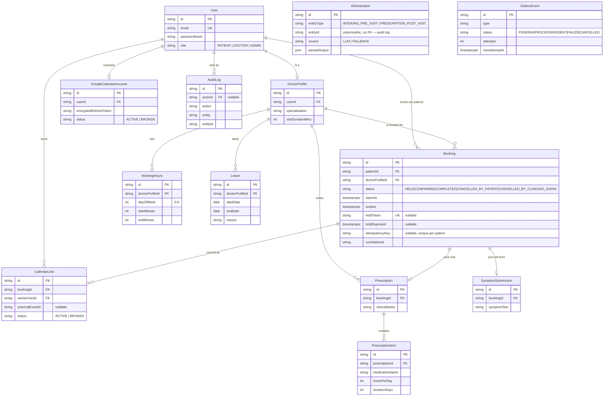
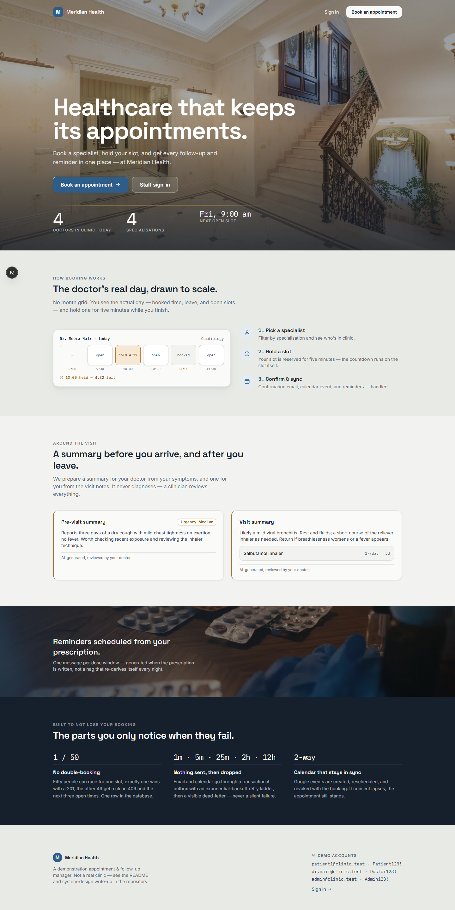
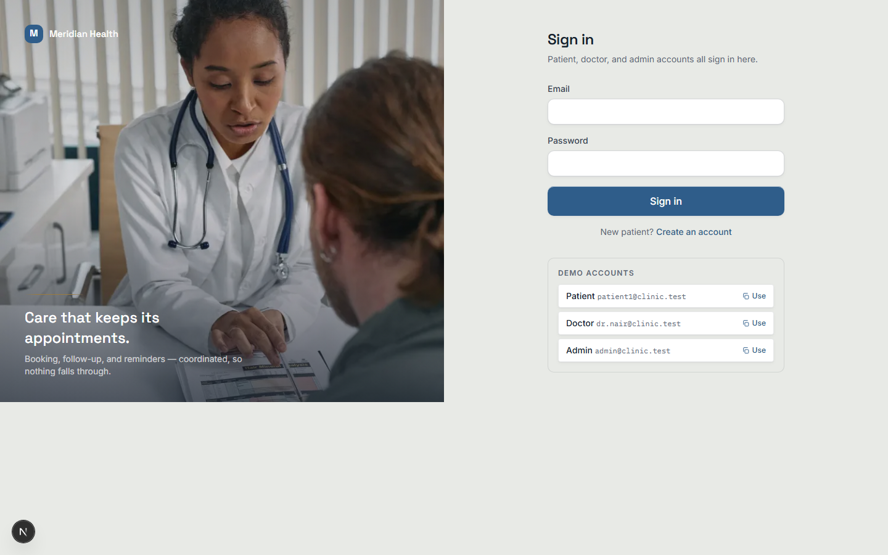
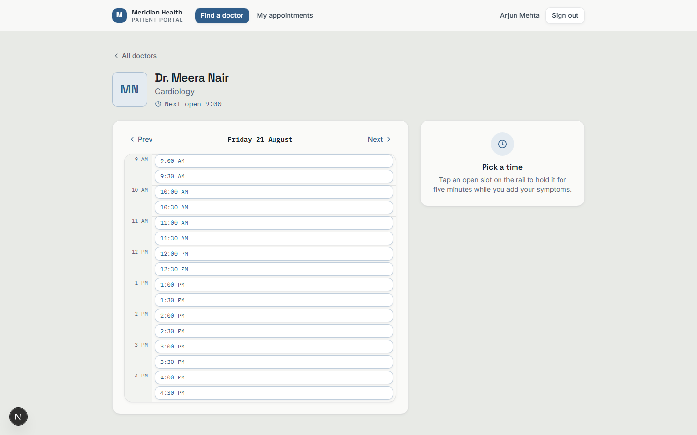
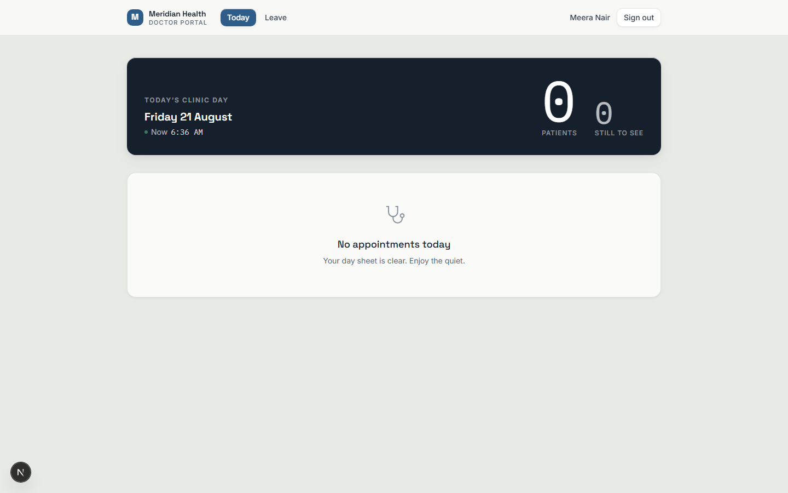
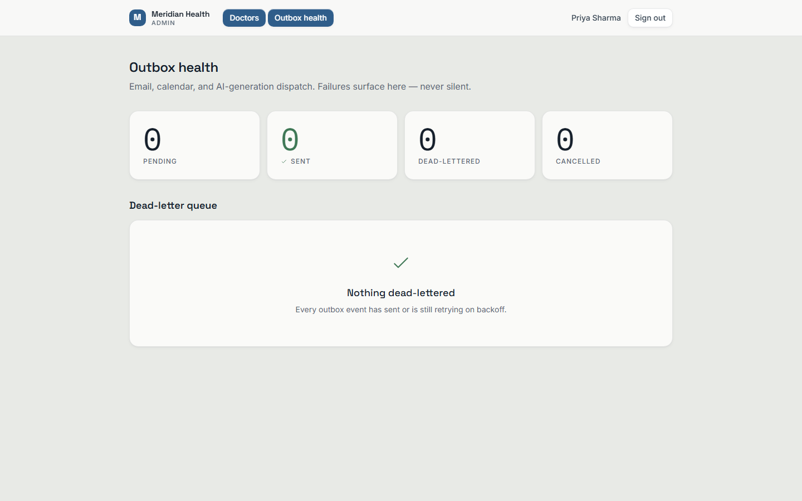

# Healthcare Appointment & Follow-up Manager

> A clinic needs more than a basic booking form. A **concurrency-safe
> booking core** (a real Postgres constraint, not application logic, proven
> under 50 simultaneous requests), a **transactional outbox** so email/
> calendar/LLM side effects can never be lost or duplicated, and an **LLM
> triage layer** that degrades to a deterministic fallback instead of
> breaking the booking flow — wrapped in three separate patient/doctor/admin
> portals, not one dashboard with the nav filtered by role.


**Keywords:** double-booking prevention · transactional outbox pattern ·
slot hold with TTL · idempotent booking API · concurrency-safe scheduling ·
LLM pre-visit triage · deterministic LLM fallback · circuit breaker ·
red-flag symptom escalation · doctor leave conflict resolution · Next.js
App Router · Prisma · PostgreSQL partial unique index · Auth.js RBAC ·
Google Calendar OAuth sync · medication reminders · healthcare scheduling
system.

See [`DESIGN.md`](./DESIGN.md) for the frontend's design tokens and rationale,
and [`WRITEUP.md`](./WRITEUP.md) for the 800-word system design write-up
(double-booking prevention, leave conflict handling, the slot hold
mechanism, notification failure handling, and what I'd do differently).

> **Status:** feature-complete; not yet deployed to a public URL (needs a
> Vercel/Render account — see § Deployment). This README always reflects
> what's actually implemented, not the eventual target. See the checklist below.

## Build status

- [x] Phase 0 — Foundations (Next.js 15, Postgres+Prisma, Auth.js, error
      envelope, structured logging, Vitest wired to a real test DB)
- [x] Phase 1 — Schema, migrations, DB-level constraints, seed data
- [x] Phase 2 — Availability + booking core (slot hold, idempotency, the
      50-way concurrency proof)
- [x] Phase 3 — Outbox + email reliability
- [x] Phase 4 — LLM layer (pre-visit / post-visit, fallback, circuit breaker)
- [x] Phase 5 — Doctor leave conflict flow
- [x] Phase 6 — Google Calendar
- [x] Phase 7 — Medication reminders
- [x] Phase 8 — Frontend (three portals)
- [x] Phase 9 — Final docs (README, `WRITEUP.md`, ER diagram, prompts, demo
      accounts, concurrency/authorization proofs). **Hosted URL not yet
      live** — needs an account on Vercel or Render, see § Deployment.

## Quick start

Requires Node.js 20+, Docker Desktop, and npm.

```bash
git clone <repo-url> hospital
cd hospital
cp .env.example .env      # generate real secrets for NEXTAUTH_SECRET,
                           # CRON_SECRET, TOKEN_ENCRYPTION_KEY — see below
docker compose up -d      # Postgres for dev (5432) + test (5433)
npm install
npm run db:push           # applies migrations, incl. the hand-written SQL
                           # constraints in prisma/migrations/*/migration.sql
npm run seed               # 1 admin, 4 doctors, 6 patients, demo data
npm run dev
```

`npm run db:push` runs `prisma migrate deploy`, not `prisma db push` —
`db push` only syncs the declarative parts of `schema.prisma` and would
silently skip the hand-written partial unique index and exclusion
constraint in the migration's raw SQL, which is what actually prevents
double-booking (see [§ Double-booking prevention](#double-booking-prevention)
below). The script is named `db:push` anyway so the literal command from a
typical setup checklist still works.

Generate the three secrets `.env.example` calls out:

```bash
node -e "console.log(require('crypto').randomBytes(32).toString('base64'))"
```

Run it three times for `NEXTAUTH_SECRET`, `CRON_SECRET`, and
`TOKEN_ENCRYPTION_KEY`.

### What works with zero extra setup

Email (Ethereal), the LLM layer (deterministic fallback), and Google
Calendar (disabled state) all have safe defaults — the app is fully
functional with only the two `DATABASE_URL`s set. Add `GEMINI_API_KEY`,
`RESEND_API_KEY`, or the `GOOGLE_CLIENT_*` pair later for the real
integrations; nothing else changes. See `.env.example` for what each
variable does.

### Demo accounts

| Role    | Email                   | Password     |
|---------|-------------------------|--------------|
| Admin   | admin@clinic.test       | `Admin123!`  |
| Doctor  | dr.nair@clinic.test     | `Doctor123!` | Cardiology
| Doctor  | dr.kapoor@clinic.test   | `Doctor123!` | Dermatology
| Doctor  | dr.khan@clinic.test     | `Doctor123!` | Pediatrics
| Doctor  | dr.rao@clinic.test      | `Doctor123!` | Orthopedics
| Patient | patient1@clinic.test .. patient6@clinic.test | `Patient123!` |

### Tests

```bash
npm test                    # Vitest, against the port-5433 test DB — never the dev DB
npm run concurrency-test    # the 50-way double-booking proof (Phase 2)
npm run authorization-proof # a patient hitting every doctor/admin-only route -> 403 (needs `npm run dev` running)
```

### Demo reset

`POST /api/demo/reset` wipes every row the app owns and re-seeds the
standard demo data — the deliverable's "hosted URL with a demo-reset
endpoint so the grader can re-run the flow." Disabled by default (the route
404s) until `DEMO_RESET_SECRET` is set, and deliberately a *different*
secret from `CRON_SECRET` — this one is strictly more destructive, and a
non-demo deployment shouldn't ship a public "wipe the database" button by
default.

```bash
curl -X POST https://<your-deployment>/api/demo/reset \
  -H "Authorization: Bearer $DEMO_RESET_SECRET"
```

## Database schema



`AiGeneration` is intentionally not drawn with a foreign key to `Booking` or
`Prescription` — it is a polymorphic, append-only audit table
(`entityType` + `entityId`), not a live relation. See `prisma/schema.prisma`
for the full field list and every index.

### Double-booking prevention

The database, not application code, is the source of truth:

```sql
CREATE UNIQUE INDEX "booking_doctor_active_slot_uidx"
  ON "Booking" ("doctorProfileId", "startsAt")
  WHERE "status" IN ('HELD', 'CONFIRMED');
```

A partial unique index — cancelled/completed/no-show rows don't hold the
slot, so it's immediately bookable again, but no two `HELD`/`CONFIRMED` rows
can ever exist for the same doctor at the same instant, no matter how the
application code races. Proof (direct `psql`, bypassing the app entirely):

```
$ docker exec -i hospital-db-1 psql -U hospital -d hospital
-- first CONFIRMED insert for doctor X at 2026-12-01 09:00 UTC
INSERT INTO "Booking" (...) VALUES (..., 'CONFIRMED', '2026-12-01 09:00:00+00', ...);
INSERT 0 1
-- second CONFIRMED insert, same doctor, same slot, different patient
INSERT INTO "Booking" (...) VALUES (..., 'CONFIRMED', '2026-12-01 09:00:00+00', ...);
ERROR:  duplicate key value violates unique constraint "booking_doctor_active_slot_uidx"
DETAIL:  Key ("doctorProfileId", "startsAt")=(ab1a018d-..., 2026-12-01 09:00:00) already exists.

SELECT count(*) FROM "Booking" WHERE "doctorProfileId" = '...' AND "startsAt" = '2026-12-01 09:00:00+00';
 rows_for_this_slot
--------------------
                  1
```

Full transcript: [`docs/db-constraint-proof.txt`](./docs/db-constraint-proof.txt).
The same is true of `Leave` date ranges, via a `btree_gist` exclusion
constraint (`prisma/migrations/*/migration.sql`) — overlapping leave for one
doctor is rejected by Postgres, not just checked in a service.

### The four-layer booking strategy

1. **DB constraint** — the partial unique index above. The real guarantee;
   everything else exists to make failure cheap and recoverable rather than
   to *be* the guarantee.
2. **Transaction + advisory lock.** `holdSlot()` (`src/services/booking.ts`)
   takes `pg_advisory_xact_lock(hashtext(doctorId || startsAt))` before
   inserting, so concurrent requests for the *same* slot serialize instead
   of racing — one insert succeeds, the rest see the row already exists and
   fail fast, instead of all 50 hitting Postgres and 49 throwing. A Prisma
   `P2002` (unique violation) is caught and turned into `409 SLOT_TAKEN` with
   the next three available slots in the body, so a conflict is a recovery
   path, not a dead end. Read-only checks (leave, working hours) run *before*
   the lock is taken, to keep the serialized section as short as possible
   under contention.
3. **Slot hold with 5-minute TTL.** `POST /api/slots/hold` creates a `HELD`
   row and returns a `holdToken`; `POST /api/appointments` converts it to
   `CONFIRMED`. Expired holds are reaped both inline (defensively, inside
   `holdSlot`, for the exact slot being requested) and by `POST /api/jobs/tick`
   (all of them, for holds nobody ever retries).
4. **Idempotency.** `POST /api/appointments` accepts an `Idempotency-Key`
   header; a repeat with the same key replays the original result. The hold
   token itself is also a natural idempotency key — replaying the exact same
   confirm call is safe even without the header.

### Concurrency proof

`scripts/concurrency-test.ts` fires 50 real, concurrent `POST /api/slots/hold`
HTTP requests (not direct function calls) at one doctor + slot, against a
production build (`npm run build && npm start`), as one seeded patient — the
partial unique index is keyed on `(doctorProfileId, startsAt)` only, so this
is exactly the race the constraint exists to prevent, without needing 50
throwaway accounts. Run it yourself:

```bash
npm run build && npm start   # separate terminal
npm run concurrency-test
```

Result ([full output](./docs/concurrency-output.txt)):

```
Fired 50 concurrent requests in 31012ms.
  201 Created:     1
  409 Conflict:    49
  other:           0

Rows in the database for this slot: 1
  id=dd36c8c4-1e5b-42e3-a2bc-f0705760c29e status=HELD patientId=1857dc5b-392a-4394-b93c-ff81663e99b9

Result: PASS
```

Exactly 1 success, 49 clean conflicts, 1 database row. Note: this deliberately
adversarial case (50 requests for the literal same slot at the literal same
instant) needed a widened Prisma transaction `maxWait`/`timeout` and a larger
Postgres connection pool (see `.env.example`) — defaults are tuned for normal
traffic, not that scenario. The correctness guarantee (the DB constraint)
does not depend on this tuning; only how fast the 49 losers each hear "no"
does.

## Notification reliability — the transactional outbox

Email is never sent inline in a request handler — that would lose the
message on a crash and block the response on a third party's latency. The
domain write and the outbox insert happen in the same DB transaction
(`confirmBooking` in `src/services/booking.ts`), so a booking can never
exist without its notification jobs queued, and vice versa. Proven live
(real Ethereal SMTP, not mocked) with a booking confirm → both patient and
doctor actually receive an email, and separately proven with a mocked dead
SMTP host that the booking still succeeds and the outbox event retries with
growing backoff before dead-lettering — see `tests/outbox.test.ts`.

- **Worker** (`POST /api/jobs/tick`, cron-secret protected): claims due rows
  with `SELECT ... FOR UPDATE SKIP LOCKED`, safe against two overlapping
  cron runs claiming the same row. Also reclaims rows stuck in `PROCESSING`
  for 5+ minutes (a crashed worker mid-dispatch), reaps expired slot holds,
  and schedules `BOOKING_REMINDER` rows ~24h before each confirmed
  appointment.
- **Backoff**: 1m → 5m → 25m → 2h → 12h, ±20% jitter
  (`backoffDelayMs` in `src/services/outbox.ts`).
- **Dead-letter**: after 5 failed attempts, status `FAILED`. Listed for the
  admin dashboard by `GET /api/admin/outbox?status=FAILED`; a human retries
  one with `POST /api/admin/outbox/:id/retry` (resets attempts — a manual
  retry is a deliberate override, not a continuation of the automatic
  backoff). The actual dashboard page lands in Phase 8; the API is real now.
- **Idempotent dispatch**: the Resend provider is called with an
  `idempotencyKey` derived from the outbox event + recipient, so a
  crash-recovery reclaim of a `PROCESSING` row can't double-send through
  Resend. Ethereal (local/demo) has no such server-side dedup — a
  crash between "email sent" and "row marked SENT" can duplicate a demo
  email; documented as an accepted limitation of the throwaway sandbox
  provider, not of the outbox pattern itself.
- Email provider is swappable behind one interface
  (`src/lib/email/types.ts`): `EtherealEmailProvider` (default, zero setup —
  auto-provisions a throwaway inbox, logs a preview URL per send) or
  `ResendEmailProvider` (`EMAIL_PROVIDER=resend` + `RESEND_API_KEY`).
- Types not yet wired to a handler (`CALENDAR_*`, pending Phase 6) are
  deliberately left unclaimed by the worker rather than faked — better
  PENDING-forever-until-its-phase-lands than silently marked SENT for a
  side effect that never ran. `AI_PRE_VISIT_GENERATION` and
  `AI_POST_VISIT_GENERATION` are handled as of Phase 4.

## LLM layer

`src/lib/llm/`. The LLM is never on the critical path: `POST /api/appointments`
returns as soon as the booking is confirmed, and pre-visit generation runs
later, dispatched by the outbox worker like any other side effect. Same
pattern for post-visit summaries, dispatched from `POST
/api/appointments/:id/complete`.

**Failure handling**, all proven in `tests/llm.test.ts` /
`tests/llm-pii.test.ts` (no real API key needed — everything here runs
against the deterministic fallback or a mocked provider):
- No `GEMINI_API_KEY` configured → straight to fallback, no network call.
- 10s timeout, single retry, then fallback (`src/lib/llm/index.ts`).
- A response that fails Zod validation is treated as a failure, not a
  result: retried once with the validation error appended to the prompt,
  then fallback.
- **Circuit breaker**: after 3 consecutive provider failures, skip calling
  for 60s and go straight to fallback. Persisted in the DB
  (`AiCircuitBreaker`, a singleton row) rather than in memory — this app's
  target hosts (Vercel/Render free tier) run `/api/jobs/tick` and API routes
  as stateless serverless invocations, so an in-process breaker would reset
  every cold start and never actually trip.
- **Deterministic fallback**: symptom/notes text passed through verbatim
  (never paraphrased by a fallback that has no business rewriting clinical
  language), medication schedule built from the structured `PrescriptionItem`
  DB rows, generic-but-real follow-up questions/steps. Marked
  `source: "FALLBACK"` on every `AiGeneration` audit row and (once Phase 8
  renders it) in the UI.
- **Red-flag escalation is deterministic, not model-controlled**: keyword
  list in `src/lib/llm/red-flags.ts` forces `urgency: "High"` regardless of
  what the model (or the fallback) returned.
- **PII**: only symptom text / clinical notes / structured medication fields
  ever reach the provider — never name, email, phone, or DOB. Enforced by
  the function signatures themselves (`generatePreVisitSummary` takes a
  bare `symptomText` string, nothing else); proven in `tests/llm-pii.test.ts`
  by capturing the literal prompt sent to a mocked provider and asserting a
  known patient's name/email never appear in it.
- Every generation is audited: `rawResponse`, `parsedOutput`, `promptVersion`,
  `model`, `latencyMs`, `source`, `tokenCount`, `correlationId` on every
  `AiGeneration` row (`src/lib/llm/index.ts`), regardless of source.

### Prompts (versioned in `src/lib/llm/prompts.ts`)

**Pre-visit** (`pre-visit-v1`) — role, hard constraints (no diagnosis, no
inventing unreported symptoms, forced `"High"` on red-flag text), strict
JSON schema, two few-shot examples (one the vague/empty-input edge case):

```
You are a clinical intake assistant helping a doctor prepare for a patient visit.

Hard constraints:
- You do NOT diagnose. You summarise and triage for the doctor's convenience only.
- Do not invent symptoms the patient did not report. If the text is vague or
  empty, say so in "chiefComplaint" rather than guessing at specifics.
- If the symptom text contains any red-flag emergency symptom (...), you MUST
  return "urgency": "High".
- Return ONLY valid JSON matching this exact schema, no other text:
  { "urgency": "Low" | "Medium" | "High", "chiefComplaint": string, "questions": [string, string, string] }
...
Now summarise this patient's reported symptoms. Symptoms: "<symptomText>"
```

**Post-visit** (`post-visit-v1`) — 8th-grade reading level, medication
schedule constrained to *only* the structured medication list passed in
(forbidding invented medication), explicit follow-up steps, same
strict-JSON + few-shot pattern. Full text of both prompts, including the
validation-retry variant, is in `src/lib/llm/prompts.ts` — not duplicated
here to avoid the two drifting out of sync.

## Doctor leave — conflict resolution

Marking leave is a conflict-resolution flow, not a delete (the spec §2):

1. `POST /api/doctors/:id/leave/preview` — dry-run, returns exactly which
   `HELD`/`CONFIRMED` bookings the proposed range would affect (patient name,
   time), with nothing written yet. The UI shows this before the admin/doctor
   confirms (Phase 8).
2. `POST /api/doctors/:id/leave` — one transaction: creates the `Leave` row,
   moves every affected booking to `CANCELLED_BY_CLINIC` with a reason
   (never a hard delete — the row and its history survive), and queues a
   `BOOKING_CANCELLATION` + `CALENDAR_DELETE` outbox event per booking. An
   `AuditLog` row records the action. A booking outside the range, or
   already cancelled, is untouched.
3. The cancellation email (same dispatcher as any other `BOOKING_CANCELLATION`
   — nothing leave-specific about it) includes that patient's own appointment
   details and the doctor's next three real available slots, computed live
   at send time via `findNextAvailableSlots`.
4. Overlapping leave ranges for the same doctor are rejected by the same
   "DB constraint is the real guarantee" philosophy as double-booking — a
   `btree_gist` exclusion constraint (`leave_no_overlap_excl`), not just an
   application check. Verified empirically before writing the catch-and-map
   code that a Postgres exclusion-constraint violation (SQLSTATE `23P01`)
   comes back from Prisma as `PrismaClientUnknownRequestError`, not the
   `P2002` shape a *unique*-index violation gets — different code path,
   easy to get wrong by assuming it matches the booking-conflict handling.

Proven both by `tests/leave.test.ts` (preview scoping, transactional
cancel+outbox+audit-log, non-overlapping bookings survive, overlap
rejection) and live against real Ethereal: booked three real slots, marked
that day as leave, and all three patients (and the doctor) received an
actual cancellation email with three real rebooking links — the plan
Phase 5 check, run for real rather than asserted in the abstract.

## Google Calendar

Opt-in per user, never blocking a booking either way. Both `GOOGLE_CLIENT_ID`
and `GOOGLE_CLIENT_SECRET` unset (the default) is a fully supported state —
`isCalendarConfigured()` gates the connect flow, and every `CALENDAR_*`
outbox dispatcher treats "no connected account" as nothing-to-do, not an
error.

### Setup (to test the real OAuth flow — optional)

1. In [Google Cloud Console](https://console.cloud.google.com/), create a
   project, enable the **Google Calendar API**, and create an **OAuth 2.0
   Client ID** of type "Web application".
2. Add `http://localhost:3000/api/calendar/oauth/callback` as an authorized
   redirect URI (or your deployed URL's equivalent).
3. While the app is in Google's "Testing" publishing status (the default,
   and fine for this brief — no verification needed), add the Google
   account(s) you'll test with under **Audience → Test users**.
4. Set `GOOGLE_CLIENT_ID`, `GOOGLE_CLIENT_SECRET`, and `GOOGLE_REDIRECT_URI`
   in `.env`.
5. Visit `/api/calendar/oauth/start` while signed in — redirects to Google's
   consent screen (`access_type=offline`, `prompt=consent` so a refresh
   token is issued even on a repeat connect) and back to
   `/api/calendar/oauth/callback`, which exchanges the code and stores the
   encrypted refresh token.

This was **not** verified against a live Google account in this
environment — I don't have a Google Cloud project's credentials to test
with, and creating one requires the developer's own account. What *is*
proven without one: token encryption round-trips correctly
(`tests/crypto.test.ts`), and the full dispatch logic — skip-if-not-connected,
create/update/delete, idempotent-against-retry via `CalendarLink`, and the
`invalid_grant` → mark-broken-and-continue path — against a mocked Google
provider (`tests/calendar-dispatch.test.ts`), which exercises the exact same
code the real `GoogleCalendarProvider` runs, just with the actual Google API
call substituted. A recorded demo with real credentials is the honest way to
close this gap; noted under [WRITEUP.md § What I'd do differently](./WRITEUP.md#what-id-do-differently-with-more-time-or-a-paid-tier).

### How it works

- Refresh tokens are AES-256-GCM encrypted at rest
  (`GoogleCalendarAccount.encryptedRefreshToken`, `src/lib/crypto.ts`) with a
  random IV per encryption and an auth tag checked on decrypt.
- `CALENDAR_CREATE`/`UPDATE`/`DELETE` are outbox events, dispatched from
  `POST /api/jobs/tick` exactly like email — calendar failure is "an outbox
  event like any other" (the spec §7) and never rolls back a booking.
- Each side (patient, doctor) has its own `CalendarLink` row per booking, so
  syncing is per-user: a patient who never connected their calendar doesn't
  block the doctor's event from being created, and vice versa.
- **Idempotent against retry**: before creating, the dispatcher checks for
  an existing `CalendarLink` with a set `externalEventId` and skips if
  found — the Google Calendar REST API has no client-supplied insert
  idempotency key of its own to lean on, so this is enforced at the
  application layer instead. Proven by a test that dispatches the same
  `CALENDAR_CREATE` event twice and asserts the provider's create call only
  actually fired once.
- **Revoked/expired consent** (`invalid_grant`): caught, the account is
  marked `BROKEN`, and the dispatch completes successfully (not a
  retry-worthy failure) — the appointment stays valid either way. The
  UI (Phase 8) would show a "reconnect your calendar" state for a `BROKEN`
  account; not yet built.

## Medication reminders

Generated once, at the moment a doctor saves a prescription
(`completeVisit` in `src/services/visit.ts`) — not a cron that re-derives
the schedule on every tick (the spec §3). One `MEDICATION_REMINDER` outbox
row per dose window: a 3×/day, 5-day item produces exactly 15 rows, each
`nextAttemptAt` set to its own due time (`src/services/medication.ts`).
Doses are spread evenly across an 08:00–22:00 clinic-local window (a single
daily dose gets 09:00 rather than sitting at the window edge), converted to
UTC the same DST-safe way slot times are. Dispatched by the same outbox
worker as everything else — proven with a mocked email provider that a due
reminder actually sends, addressed to the patient, with the medication name
in the subject (`tests/medication.test.ts`).

The patient can view (`GET /api/prescription-items/:id/reminders`) and stop
(`POST .../reminders/stop`) their own schedule — stopping cancels every
not-yet-sent reminder for that medication and leaves already-sent ones as a
record. Both routes verify the caller owns the prescription (`NOT_FOUND` for
anyone else's, not `FORBIDDEN` — see [§ API design](#api) on 403 vs 404).

## Frontend

The UI is built in **two registers** (see [`DESIGN.md`](./DESIGN.md)): a
composed, photographic **public surface**
(`/`, `/login`, `/register`) and a dense, quiet **operational surface** (the three
portals). Getting the contrast between them right is the point — the lobby is
generous and confident; the ward is fast and information-dense. A four-level surface
system, a four-weight ink ramp, layered elevation, oversized tabular numerals, and a
rebuilt day rail carry the design; a rationed brass accent marks the institution.

### Screens

| Landing (`/`) | Sign-in (`/login`) |
|---|---|
|  |  |

| Patient — book (the day rail) | Doctor — today |
|---|---|
|  |  |

| Admin — outbox health |
|---|
|  |

Every route is screenshotted at **1440px and 390px** under
[`docs/screens/`](docs/screens) — regenerate with `npm run shoot` (logs in as each
seeded role and captures every page at both widths).

### Portals

- **Patient**: home leads with the next-visit numeral and portrait doctor cards →
  day rail → optimistic hold (SVG countdown ring; a `409` shakes the slot and slides
  in three alternatives) → symptom panel → confirm. "My appointments" features the
  next visit as one large card, brass-ruled AI summaries with the disclosure line,
  and the medication schedule as a **dose strip** (24-hour rail with dose markers),
  plus per-medication reminders you can view and stop.
- **Doctor**: an inverse "today" header with the patient-count numeral and a live
  clock; a pinned high-urgency strip (label + icon + weight + color, never color
  alone); the day sheet; appointment detail with the full pre-visit summary and
  suggested questions; a complete-visit **sheet** (notes + a prescription list whose
  items spring in and collapse out); leave with the impact preview before confirming.
- **Admin**: densest screen — doctor roster as a real table with a sticky header;
  outbox health as big counters where a non-zero **dead-letter count turns urgent
  and says "needs attention"**, above the dead-letter list with one-click retry.

Every state is designed: loading (shimmer skeletons matching the final layout), empty
(custom SVG in the token palette + an invitation to act), error (`ErrorBanner` —
what happened + retry), and the AI-fallback state (marked, never hidden). The public
landing pulls **live numbers from `/api/stats`** (doctors in clinic today,
specialisations, next open slot) — real system state, not hardcoded.

### Imagery, motion, accessibility

- **Imagery** — 12 curated photographs committed as optimized `.webp` (hero 152KB,
  portraits 10–18KB), served through `next/image` with blur placeholders and a uniform
  CSS grade; credits in [`docs/image-credits.md`](docs/image-credits.md). Zero
  decorative photography inside the portals — the one exception is the functional
  doctor portrait.
- **Motion** (framer `motion`) carries state, not decoration: the day-rail hold
  interaction, the depleting countdown ring (crossing clinical→caution→urgent with the
  label changing too), the right-hand sheet, staggered list entry, and number-roll on
  the focal numerals. All of it is disabled under `prefers-reduced-motion` via
  `MotionConfig reducedMotion="user"` plus a `globals.css` media query —
  **verified by toggling** (0 elements left stuck hidden).
- **Accessibility** — `npm run a11y` runs an **axe-core WCAG 2 A/AA** audit of every
  route as each role. **All 9 routes pass with 0 violations.** Contrast was fixed
  against real axe findings (a dedicated `--caution-ink` for small caution text, body
  text promoted off the placeholder tone). Visible `:focus-visible` rings, real
  `<label>`s, focus moves into the sheet and returns on close, works at 375px.
- **Lighthouse** (production build, `next start`, headless Chrome):

  | Route | Perf | A11y | Best-practices |
  |---|---|---|---|
  | `/` (landing, desktop) | **100** | **100** | **100** |
  | `/` (landing, mobile) | **93** | **100** | — |
  | `/login` (desktop) | **100** | **100** | **100** |

  The landing carries the hero photograph and still scores LCP 0.7s / CLS 0 on
  desktop (LCP 2.8s / CLS 0.011 on throttled mobile) — explicit image dimensions mean
  no layout shift. Portal routes need an authenticated session; their accessibility is
  covered by the axe audit above.

### Real bugs the "look at what you build" process caught

Not hypothetical — each was found by using/auditing the app in a browser and is in
`git log` with its fix and reasoning:

- **Hydration mismatch (SSR locale).** `toLocale*` ran with the runtime's default
  locale, so the server rendered `Friday 21 August` while the browser rendered
  `Friday, August 21`. React can't reconcile that and **regenerated the tree on every
  load**, which briefly drops event handlers (felt like "clicks don't register").
  Fixed by pinning the formatter locale — every date/time render, app-wide.
- **Day-rail render jank.** framer's `layout` sat on all ~16 slot buttons, re-measuring
  them every render (once a second during a hold). Removed; kept only the
  state-carrying motion (the pending lift, the 409 shake). Also swapped the sticky
  header's `backdrop-blur` (repaints every scroll frame) for a solid surface.
- **Hero layout bug.** The `Photo` wrapper's hardcoded `relative` beat the caller's
  `absolute`, pushing hero content down into the sections below.
- **Auth panels short of the viewport** (`min-height:100%` doesn't resolve without an
  explicit parent height → `min-h-screen`), a **double-highlighted nav** (parent route
  matched as a prefix → longest-prefix match), and a batch of **axe AA contrast
  failures** (a dedicated `--caution-ink`, body text off the placeholder tone).
- **Backend, earlier:** a display-duplication bug, a clinic-timezone rendering bug
  (times shown in the server's timezone, not the clinic's), and a day-boundary bug
  where a doctor's "today" silently matched zero bookings.

## API

Documented as each phase adds routes.

| Method | Path | Auth | Notes |
|---|---|---|---|
| `GET`/`POST` | `/api/auth/[...nextauth]` | — | Auth.js credentials sign-in |
| `GET` | `/api/health` | none | Liveness + DB connectivity check |
| `GET` | `/api/doctors?specialisation=` | any signed-in user | List/search doctors |
| `POST` | `/api/doctors` | ADMIN | `{ email, password, name, specialisation, slotDurationMins, workingHours[] }` → creates the account + profile + hours |
| `GET` | `/api/admin/doctors` | ADMIN | Full doctor roster incl. email + working hours (the admin table) |
| `GET` | `/api/doctors/:id/availability?date=YYYY-MM-DD` | any signed-in user | Computed open slots |
| `POST` | `/api/slots/hold` | PATIENT | `{ doctorProfileId, startsAt }` → `{ holdToken, holdExpiresAt, ... }`, `409 SLOT_TAKEN` on conflict |
| `POST` | `/api/appointments` | PATIENT | `{ holdToken, symptomText }` + optional `Idempotency-Key` header → confirms a hold |
| `POST` | `/api/appointments/:id/complete` | DOCTOR (owner only) | `{ clinicalNotes, prescriptionItems[] }` → CONFIRMED → COMPLETED, queues post-visit AI generation |
| `POST` | `/api/appointments/:id/cancel` | PATIENT (owner only) | `{ reason? }` → CANCELLED_BY_PATIENT, queues cancellation email + calendar delete |
| `GET` | `/api/calendar/oauth/start` | any signed-in user | Redirects to Google's consent screen |
| `GET` | `/api/calendar/oauth/callback` | any signed-in user | Exchanges code, stores encrypted refresh token |
| `POST` | `/api/calendar/disconnect` | any signed-in user | Removes the caller's connected Google account |
| `GET` | `/api/prescription-items/:id/reminders` | PATIENT (owner only) | List a medication's reminder schedule |
| `POST` | `/api/prescription-items/:id/reminders/stop` | PATIENT (owner only) | Cancels remaining (not-yet-sent) reminders |
| `POST` | `/api/jobs/tick` | `Authorization: Bearer $CRON_SECRET` | Reaps expired holds, schedules reminders, drains the outbox |
| `POST` | `/api/demo/reset` | `Authorization: Bearer $DEMO_RESET_SECRET` | Wipes + re-seeds all data; `404` unless `DEMO_RESET_SECRET` is set |
| `GET` | `/api/admin/outbox?status=` | ADMIN | List outbox events (dead-letter view) |
| `POST` | `/api/admin/outbox/:id/retry` | ADMIN | Manually retry a `FAILED` event |
| `GET` | `/api/doctors/:id/leave` | ADMIN or owning DOCTOR | List leave ranges |
| `POST` | `/api/doctors/:id/leave/preview` | ADMIN or owning DOCTOR | `{ startDate, endDate }` → affected bookings, no writes |
| `POST` | `/api/doctors/:id/leave` | ADMIN or owning DOCTOR | Creates leave + cancels affected bookings, `409 LEAVE_OVERLAP` on conflict |
| `DELETE` | `/api/doctors/:id/leave/:leaveId` | ADMIN or owning DOCTOR | Removes a leave range |

Every route uses one error envelope: `{ error: { code, message, details? } }`
(`src/lib/errors.ts`) with stable codes (`SLOT_TAKEN`, `HOLD_EXPIRED`,
`HOLD_NOT_FOUND`, `DOCTOR_ON_LEAVE`, `ILLEGAL_STATE_TRANSITION`, `VALIDATION_ERROR`,
`UNAUTHENTICATED`, `FORBIDDEN`, `NOT_FOUND`, `LLM_UNAVAILABLE`, `RATE_LIMITED`,
`INTERNAL_ERROR`). Every response carries `x-correlation-id`. Layering is
route → service → repository: business rules live in `src/services/*` and
are unit-tested without HTTP (`tests/booking.test.ts`); route handlers only
parse input (Zod), call a service, and map the result to a response.

## Deployment

Not yet deployed to a public URL from this environment — that step needs an
account on the host (Vercel or Render), which isn't something to create on
someone else's behalf. Everything short of clicking "deploy" is ready:

### Vercel (recommended — zero-config for a Next.js app)

1. Push this repo to GitHub, then [import it on Vercel](https://vercel.com/new).
2. Add every variable from `.env.example` in Project Settings → Environment
   Variables (a managed Postgres add-on — Vercel Postgres, or Neon/Supabase —
   for `DATABASE_URL`; a second database, or a separate schema, for
   `TEST_DATABASE_URL` if you want CI to run `npm test` there too).
3. Deploy. `vercel.json` in this repo already configures a Vercel Cron Job
   hitting `POST /api/jobs/tick` every minute — Vercel automatically sends
   `Authorization: Bearer $CRON_SECRET` on cron-triggered requests when an
   env var literally named `CRON_SECRET` is set, which is exactly what this
   route expects.
   **Tier caveat**: Vercel's Hobby (free) plan has historically capped cron
   frequency below once-per-minute. If your account is limited, either
   upgrade, or point an external scheduler (e.g. cron-job.org,
   EasyCron) at `POST /api/jobs/tick` with the `Authorization` header set
   yourself — the route doesn't care who calls it, only that the secret
   matches. This exact free-tier tradeoff is discussed in
   [`WRITEUP.md`](./WRITEUP.md).
4. Run `npm run db:push` and `npm run seed` once against the production
   `DATABASE_URL` (e.g. `vercel env pull` locally, then run both commands),
   or trigger `POST /api/demo/reset` once `DEMO_RESET_SECRET` is set.

### Render (alternative — real Cron Jobs, not HTTP-triggered)

1. New Web Service from this repo; build command `npm ci && npm run build`,
   start command `npm start`.
2. New PostgreSQL instance (free tier) for `DATABASE_URL`.
3. New Cron Job service running
   `curl -X POST $APP_URL/api/jobs/tick -H "Authorization: Bearer $CRON_SECRET"`
   on a 1-minute schedule.
4. Same environment variables as above.

Either way, `GET /api/health` is the smoke test once it's live, and
`POST /api/demo/reset` (§ Demo reset, above) resets to the seeded state for
a grader to re-run the flow from a clean slate.
